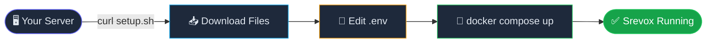
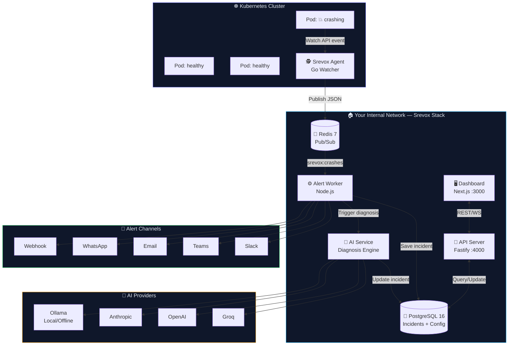

<div align="center">

<br/>


<br/>

# ⚡ Srevox Setup & Deployment

### **Self-Hosted Kubernetes Pod Crash Alerting with AI Diagnostics**

*Official deployment configurations and orchestration tools to host Srevox on your own infrastructure.*

<br/>

[](https://hub.docker.com/u/akshatsaini08)
[](https://golang.org)
[](#-license)
[](https://nodejs.org)

<br/>

> 🐳 **No clone needed. Just Docker + a `.env` file.**
> Built for on-prem, VMware, bare-metal, private cloud & air-gapped environments.

<br/>

[🚀 Quick Start](#-quick-start--no-clone-needed) · [🔌 Connect Cluster](#-connect-your-k8s-cluster) · [🏗️ Architecture](#%EF%B8%8F-architecture) · [🤖 AI Diagnosis](#-ai-diagnosis) · [⚙️ Configuration](#%EF%B8%8F-environment-variables) · [🧪 Testing](#-testing-your-setup)

</div>

---

## ⚡ What is Srevox?

Srevox watches your Kubernetes clusters 24/7 using the **K8s Watch API** and instantly notifies your team the moment a pod crashes — delivering structured diagnostics and AI-powered root-cause analysis directly to your chat tools.

Built for **on-premises, VMware, bare-metal, private cloud, and air-gapped** environments. No telemetry, no cloud dependencies, and zero data leaving your network.

---

## ✨ Features

* ⚡ **Instant Detection**: Sub-5s crash detection via K8s Watch API (no polling).
* 🔔 **Multi-Channel Alerts**: Rich notifications to Email, Slack, Teams, and WhatsApp.
* 🤖 **AI Diagnosis**: Automatic root-cause explanations and suggested YAML patches.
* 🛡️ **Noise Control**: Cooldown windows, restart count thresholds, and namespace exclusions.
* 👤 **Service Owners**: Route crashes to the specific engineers who own the namespace/pods.
* ☁️ **Universal Watching**: Seamless support for EKS, GKE, AKS, bare-metal, or minikube.

---

## 🚀 Quick Start — No Clone Needed

### Prerequisites
* **Docker** installed.
* **Docker Compose** active.

### Deployment Flow



**1️⃣ Run the setup command:**
```bash
curl -fsSL https://raw.githubusercontent.com/Akshatsainiaks/srevox-setup/main/setup.sh | bash
```
This script creates a `srevox` directory, downloads `docker-compose.yml`, and prepares a `.env` template file.

**2️⃣ Configure the environment variables:**
```bash
cd srevox && nano .env
```
Ensure you fill in your secure credentials and server addresses:
```env
POSTGRES_PASSWORD=your_secure_password
BACKEND_SECRET_KEY=any_random_32_char_string_here__   # min 32 chars
ENCRYPTION_KEY=exactly_32_chars_here____________       # exactly 32 chars
NEXT_PUBLIC_API_URL=http://YOUR_SERVER_IP:4000
FRONTEND_URL=http://YOUR_SERVER_IP:3000

# ── AI Diagnosis (pick one) ───────────────────────────────────────
AI_PROVIDER=groq                                       # groq | openai | anthropic | ollama
GROQ_API_KEY=gsk_...                                   # free at console.groq.com
```

**3️⃣ Spin up Srevox:**
```bash
docker compose up -d
```

| Service | Port | Default Credentials |
|---|---|---|
| 🖥️ Dashboard | `3000` | `admin@srevox.local` / `admin123` |
| 🔌 API Server | `4000` | JWT Auth |

> ⚠️ **Change the default administrator password immediately after your first login.**

---

## 🔌 Connect Your K8s Cluster

Once Srevox is running on your server, connect your Kubernetes clusters to monitor them.

```bash
# 1. Deploy the cluster agent workload
kubectl apply -f \
  https://raw.githubusercontent.com/Akshatsainiaks/srevox-setup/main/srevox-agent.yml

# 2. Configure environment details (Get CLUSTER_ID from Dashboard → Clusters → Add Cluster)
kubectl set env deployment/srevox-agent -n kube-system \
  REDIS_URL=redis://YOUR_SREVOX_IP:6379 \
  CLUSTER_ID=YOUR_UUID_FROM_DASHBOARD \
  CLUSTER_NAME=production

# 3. Stream agent connection logs
kubectl logs -n kube-system deployment/srevox-agent -f
```

---

## 🏗️ Architecture



* **Go Watcher (Agent)**: Runs as a single pod in your cluster, watches for container restarts, and publishes JSON payloads outbound to Redis.
* **Alert Worker**: Evaluates namespace exclusions, threshold limits, cooldown triggers, and dispatches structured cards to configured endpoints.
* **AI Diagnostics Service**: Pulls failed container logs, triggers LLM pipelines, and yields root-cause explanations and YAML fix patches.

---

## 🤖 AI Diagnosis

Click **AI Diagnosis** on any incident to instantly receive:
* **Root Cause**: An plain-English explanation of why the container crashed (OOM limits, config mismatch, port conflicts, database timeouts).
* **Fix Action**: Exact `kubectl` commands populated with the correct namespaces and resource labels.
* **Suggested Patch**: Pre-formatted YAML config patches that you can apply directly.

### Supported LLMs
* **Groq** (Fastest, free tier).
* **OpenAI** (GPT-4o, GPT-4o-mini).
* **Anthropic** (Claude 3.5 Sonnet).
* **Ollama** (Runs fully local on your hardware for complete privacy).

---

## ⚙️ Environment Variables

### Required
* `POSTGRES_PASSWORD`: The database password for PostgreSQL.
* `BACKEND_SECRET_KEY`: Random string (min 32 characters) used to sign user JWT authorization tokens.
* `ENCRYPTION_KEY`: Cryptographic key (exactly 32 characters) used to encrypt integration webhooks and channel configurations at rest.
* `NEXT_PUBLIC_API_URL`: The HTTP address of the API service as reachable from your browser.
* `FRONTEND_URL`: The address of the Dashboard service for CORS routing.

---

## 🧪 Testing Your Setup

### 1. Verify alert worker connection
```bash
redis-cli -h YOUR_REDIS_IP -p 6379 PUBSUB NUMSUB srevox:crashes
# Expected output: (integer) 1
```

### 2. Send a simulated crash payload
```bash
redis-cli -h YOUR_REDIS_IP -p 6379 PUBLISH srevox:crashes '{
  "cluster_id":     "YOUR_CLUSTER_UUID",
  "pod_name":       "test-pod-crash",
  "namespace":      "default",
  "container_name": "app",
  "crash_reason":   "OOMKilled",
  "restart_count":  3,
  "exit_code":      137,
  "pod_labels":     {},
  "raw_event":      {},
  "detected_at":    "2026-06-21T10:00:00Z"
}'
```

---

## 📄 License

The orchestration scripts, environment variables, and setup templates inside this repository are public configurations provided to facilitate the deployment of Srevox. The core Srevox applications, watchers, and APIs remain proprietary. All rights reserved.
